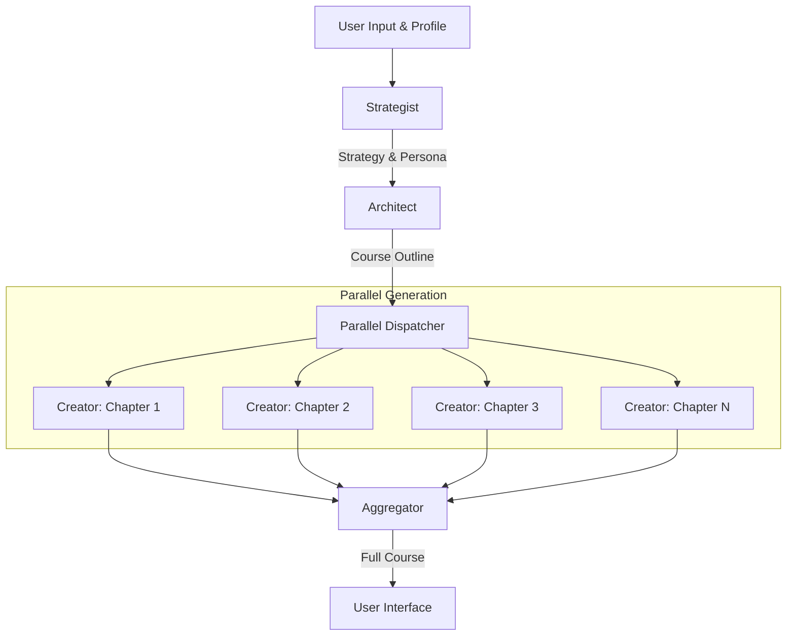

# Multi-Stage Agentic Generation Architecture

## Overview
This document outlines the architecture for the "Lumina Agentic Generation Pipeline". Instead of a single monolithic prompt, we utilize a multi-stage, role-based approach to generate high-quality, personalized curriculums. This ensures stability (avoiding token limits) and depth (better personalization).

## Core Philosophy
**"Divide and Conquer"**
By splitting the generation process into distinct phases, we allow the AI to focus on specific tasks (structure vs. content) without context overload.

## The Agents (Roles)

### 1. 🧠 The Strategist (Profile Analyzer)
*   **Input**: User's Big5 Profile, Topic.
*   **Role**: Analyzes the user's personality to determine the "Teacher Persona" and "Pedagogical Strategy".
*   **Output**: `PedagogicalManifest` (Persona definition, Tone guidelines, Reasoning).
*   **Model**: `gemini-2.5-flash` (Fast)

### 2. 🏗️ The Architect (Curriculum Designer)
*   **Input**: Topic, `PedagogicalManifest`.
*   **Role**: Designs the course skeleton. Determines the title, description, and the list of chapters (titles & objectives only).
*   **Output**: `CourseOutline` (Course metadata + Chapter list without slides).
*   **Model**: `gemini-2.5-flash` (Fast)

### 3. ✍️ The Creator (Content Writer)
*   **Input**: Chapter Title, Chapter Objective, `PedagogicalManifest`.
*   **Role**: Writes the detailed content for a *single* chapter, including slides, bullets, and the speech script.
*   **Execution**: Runs in **PARALLEL** for all chapters.
*   **Output**: `ChapterDetails` (Slides, Speech Script).
*   **Model**: `gemini-2.5-flash` (or `gemini-3.0-pro` for deep reasoning if needed).

## Data Flow

## Technical Implementation
*   **No Heavy Frameworks**: Pure TypeScript + `@google/genai` SDK.
*   **Strict Schemas**: Every stage uses `responseSchema` to guarantee JSON validity.
*   **Parallel Execution**: Use `Promise.all()` to generate all chapters simultaneously, keeping total generation time low (approx 10-15s).
*   **Token Management**: By splitting chapters, we bypass the output token limit for the full course.

## Benefits
1.  **Personalization**: The "Strategist" ensures every word aligns with the user's vibe.
2.  **Reliability**: Smaller generation tasks mean fewer JSON errors and hallucinations.
3.  **Completeness**: `speechScript` is never truncated because each request has fresh token quota.
