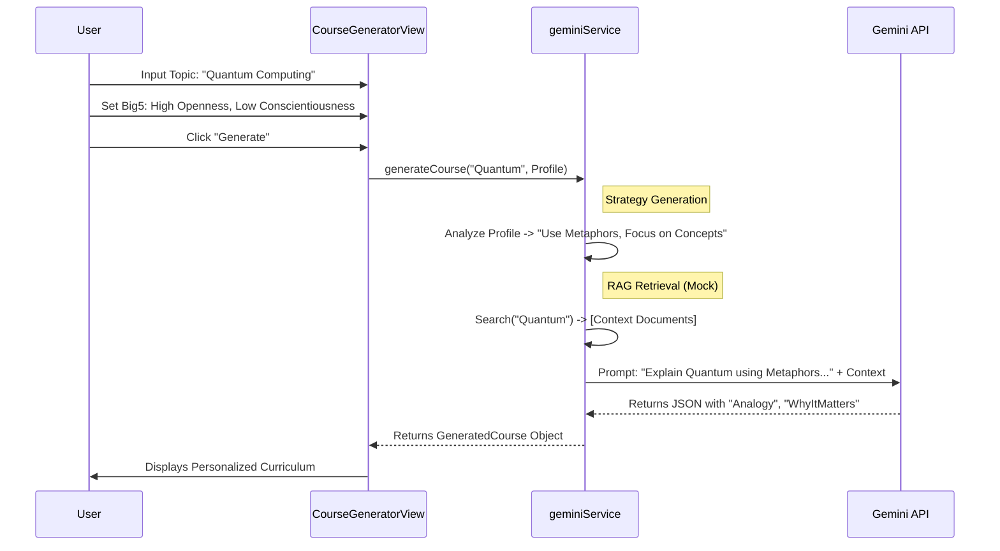

# Architecture Diagram - Lumina Learning Platform

## Personalized AI Learning Architecture

```mermaid
graph TD
    User[User] -->|Interacts| Frontend[React Frontend]

    subgraph "Frontend Application"
        App[App.tsx (Router)]
        
        subgraph "Features"
            Dashboard[Dashboard Feature]
            Generator[Course Generator UI]
            LessonView[Generated Lesson View]
            StaticModules[Static Modules (Art/Code/Blender)]
        end
        
        subgraph "Common"
            Layout[Layout & Navigation]
            UIComponents[Shared UI]
        end
    end

    subgraph "Service Layer"
        GeminiSvc[geminiService.ts]
        CurriculumSvc[curriculumData.ts]
        MockRAG[Mock Vector Store]
    end

    subgraph "AI Infrastructure"
        GeminiAPI[Google Gemini API]
        ModelFlash[Gemini 2.0 Flash]
        ModelPro[Gemini 3.0 Pro]
    end

    App --> Layout
    Layout --> Dashboard
    Layout --> StaticModules
    Layout --> Generator
    
    Generator -->|Topic + Big5 Profile| GeminiSvc
    GeminiSvc -->|Pedagogical Strategy| GeminiSvc
    GeminiSvc -->|Context Retrieval| MockRAG
    
    GeminiSvc -->|Prompt + Context| GeminiAPI
    GeminiAPI -->|Select| ModelFlash
    GeminiAPI -->|Select| ModelPro
    
    GeminiAPI -->>|Structured JSON| GeminiSvc
    GeminiSvc -->>|GeneratedCourse| App
    App -->|Render Data| LessonView
```

## Personalization Data Flow


