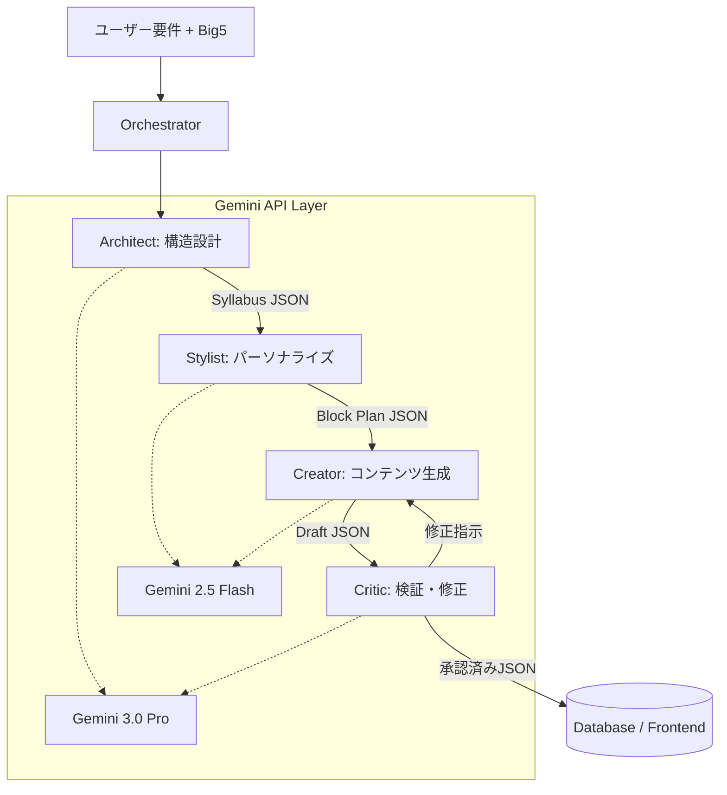

# マルチエージェント・システム詳細設計書: Lumina Orchestrator

## 1. システム概要
本システムは、4つの専門エージェントをオーケストレートし、ユーザーの性格特性（Big5）に最適化された学習コンテンツを生成する。単一プロンプトの限界を超え、論理性、パーソナライズ、技術的正確性の3つを同時に担保する。

## 2. アーキテクチャ図

### 2.1 データフロー図


### 2.2 エージェント間インターフェース（データ型）

エージェント間は、厳密に定義されたJSONスキーマで通信する（Geminiの `responseMimeType: "application/json"` を活用）。

#### A. Syllabus Blueprint (Architect -> Stylist)
```json
{
  "topic": "Blender Basics",
  "learningObjectives": ["3D座標の理解", "基本操作の習得"],
  "essentialConcepts": [
    { "id": "coords", "title": "X/Y/Z軸", "dependency": null },
    { "id": "grab", "title": "Gキーでの移動", "dependency": "coords" }
  ]
}
```

#### B. Block Plan (Stylist -> Creator)
```json
{
  "personalityTarget": "Explorer",
  "sequence": [
    { "type": "quest", "id": "grab_exp", "logic": "先に触らせて好奇心を刺激" },
    { "type": "slide", "id": "coords_theory", "logic": "体験の後に理屈を補完" }
  ]
}
```

## 3. 各エージェントの技術仕様

### 3.1 Architect (Gemini 3.0 Pro)
*   **役割**: 教育学的な整合性の維持。
*   **制約**: 性格特性は一切考慮せず、「そのトピックを学ぶために欠かせない要素」を網羅することに集中する。

### 3.2 Stylist (Gemini 2.5 Flash)
*   **役割**: UXの最適化。
*   **戦略**: Big5の各スコアに基づき、ブロックの順序を動的に入れ替える。
    *   `High Openness`: 好奇心を煽る「問いかけ」や「抽象的メタファー」を増やす。
    *   `Low Conscientiousness`: 長いテキストを避け、短い「クエスト」に分割する。

### 3.3 Creator (Gemini 2.5 Flash)
*   **役割**: 高品質な執筆とTTS指示。
*   **技術**: プロンプト内で「演技指導5要素」を自動生成し、TTSの表現力を最大化する。

### 3.4 Critic (Gemini 3.0 Pro)
*   **役割**: ガードレール。
*   **監査項目**:
    1.  **事実確認**: Blender等のソフトウェアの操作方法は正確か？
    2.  **安全性**: 差別的、あるいは学習意欲を削ぐ表現はないか？
    3.  **フォーマット**: システムがパース可能な完全なJSONか？

## 4. エラーハンドリングと再試行 (Retry Strategy)
*   Criticがエラー（不合格）を出した場合、最大3回までCreatorに差し戻す。
*   差し戻し時には、Criticが具体的な「修正案」を提示し、Creatorがそれを反映する。
