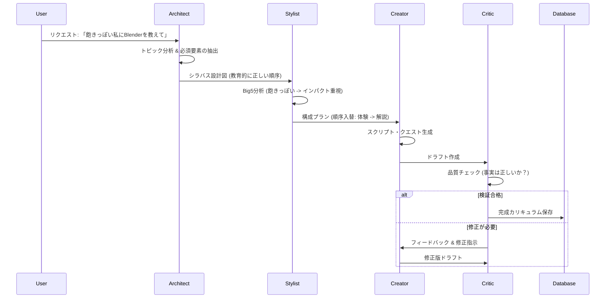

# マルチエージェント・アーキテクチャ: "The Lumina Council" (ルミナ評議会)

## 概要
高品質かつパーソナライズされたマルチフォーマット・カリキュラム（対話、クエスト、スライド等の複合）を生成するため、単一のAIプロンプトではなく、専門化された複数のエージェントが協調して動作する**マルチエージェント・システム (MAS)** を採用します。

このアーキテクチャは、自律的改善サイクルである **PEERパターン (Plan, Execute, Express, Review)** を教育コンテンツ生成向けに最適化したものです。

## 🏛️ エージェント構成 (役割定義)

### 1. 🏗️ 構築官 - The Architect (Planner)
*   **役割**: 教育構造設計 (Instructional Designer)
*   **ゴール**: **「何を教えるべきか (What)」** を定義する。学習目標とスコープを決定し、教育的な正しさを担保する。
*   **入力**: トピック（例：「Blender初級」）、難易度
*   **出力**: **シラバス設計図 (Syllabus Blueprint)**
    *   主要な学習コンセプトのリスト
    *   論理的な依存関係（Aを理解しないとBはできない）
    *   必須技術要件（例：インストール手順は省略不可）

### 2. 🎨 演出家 - The Stylist (Adapter)
*   **役割**: パーソナライズ & 体験設計 (Experience Designer)
*   **ゴール**: 設計図を**「ユーザーの性格 (Big5)」** と学習スタイルに合わせて最適化する (**How**)。
*   **入力**: シラバス設計図 ＋ Big5プロファイル
*   **出力**: **構成プラン (Block Plan)**
    *   `LearningBlock`（対話、スライド、クエスト等）の順序決定
    *   ペース配分とトーン（Vibe）の定義
    *   *例*: 「このユーザーはせっかち（誠実性低）なので、環境構築の前に『成功体験クエスト』を配置する」

### 3. ✍️ 創造者 - The Creator (Executor)
*   **役割**: コンテンツ生成 (Content Writer)
*   **ゴール**: 構成プランに基づき、実際の中身（テキスト、スクリプト、コード）を執筆する。
*   **入力**: 構成プラン
*   **出力**: **ドラフト・コンテンツ (Draft Chapter)**
    *   対話スクリプト（TTS用演技指導含む）
    *   具体的なクイズ問題
    *   技術的な手順書

### 4. ⚖️ 監査官 - The Critic (Reviewer)
*   **役割**: 品質保証 & 安全性チェック (QA / Editor)
*   **ゴール**: コンテンツの正確性、整合性、安全性を検証する。
*   **入力**: ドラフト・コンテンツ ＋ 元のユーザー要件
*   **タスク**:
    *   **ハルシネーション・チェック**: 技術的なコマンド（例：Blenderのショートカット）は正しいか？
    *   **トーン・チェック**: ユーザーを不快にさせる表現はないか？
    *   **フォーマット・チェック**: JSONスキーマは正しいか？
*   **出力**: **最終コンテンツ (Final Validated Content)** （または創造者への修正指示）

## 🔄 処理フロー (Orchestration)

## Gemini API 実装戦略

各エージェントの特性に合わせてモデルを使い分けます。

*   **Architect & Critic**: **Gemini 3.0 Pro** (高い論理的推論能力、事実確認能力)
*   **Stylist & Creator**: **Gemini 2.5 Flash** (高速な生成、創造性、TTS連携)

### 実装フェーズ
1.  **データ構造定義**: `SyllabusBlueprint` と `BlockPlan` の厳密なJSONスキーマを定義。
2.  **プロンプト連鎖**: `geminiService.ts` 内で、各エージェントの処理を関数化し、パイプラインとして接続。
3.  **フィードバックループ**: CriticがNGを出した場合の再生成ロジックの実装。

## 関連Issue
*   **Issue #3 (TTS実装)**: `Creator` エージェントは、ここで実装されたTTS用のメタデータ（演技指導プロンプト）を生成します。
*   **Issue #4 (Voice選択)**: `Stylist` エージェントは、ユーザーの性格に合わせて適切なボイスキャラクター（Kore, Puck等）を選択します。
*   **Issue #5 (マルチフォーマット)**: 本アーキテクチャは、マルチフォーマット生成を実現するためのコアエンジンとなります。
